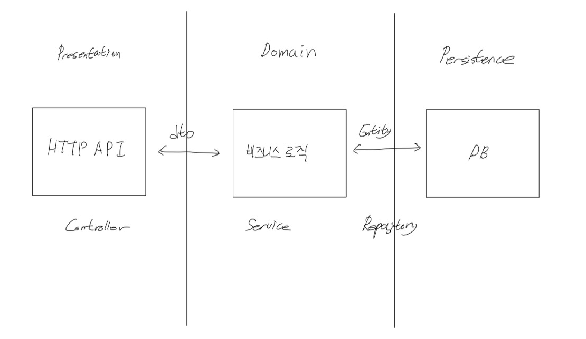

# 해냄

## 프로젝트 설명

특정 미션이 주어지고 이를 달성하는 챌린지를 개설 및 참여 할 수 있는 서비스

## 구현 기능

* 공통 기능

  회원 가입, 이메일 인증, 로그인, 비밀 번호 찾기, 회원 탈퇴, 사용자 정보 수정

* 서비스 운영

  챌린지 개설, 조회, 과제 확인

* 서비스 이용

  챌린지 신청, 취소, 조회, 과제 제출

## 사용 기술

### 주요 프레임 워크 / 라이브러리

* Java 11 openjdk
* SpringBoot 2.7.5
* SpringBoot Security
* Spring Data JPA
* Junit5

### 데이터 베이스

* MySql (운영)
* H2 (개발)

### 빌드 도구

* Gradle

## 소개

### 계층형 아키텍쳐



```
Controller 에서 REQUEST 객체로 요청 받아,
Dto 에 담아 Service 로 전달
Service 에서 Entity 로 만들어 Repository 에 전달
Service 에서 비즈니스 로직에 맞게 처리 후 
Dto 에 담아 Controller 에 전달
Controller 에서 Response 객체를 만들어 응답
```

관심사 분리를 통해 운영에 용이하도록 구현했음

* API 요구사항이 바뀌어도 비즈니스 로직에 영향을 주지 않도록, 반대도 마찬가지

### 테스트 코드 작성

비즈니스 로직을 개발하며 테스트를 통해 로직이 정상적인지 확인하고,

코드를 수정함으로 오는 사이드 이펙트는 없는지 검증 했음.

### 예외처리

프로그램이 제대로 된 흐름으로 동작하도록 먼저 개발

정상적이지 못한 흐름에서 Exception 터뜨림

열거형 이용해 에러 메시지 관리

ControllerAdvice 를 이용해 상황에 맞게 원하는 HTTP API 응답 반환

### JPA

DB 의 테이블을 객체처럼 사용할 수 있고, 지연로딩으로 성능을 최적화 할 수 있는 JPA 적용하며 학습

지연 로딩으로 인해 발생하는 N+1 문제 fetch join 으로 해결

회원 탈퇴시 외래키 제약조건으로 발생하는 에러를

양방향 연관 관계를 맺고 orphanRemoval 과 cascade 설정을 이용해

회원 탈퇴시 관련된 데이터가 같이 삭제 되도록 처리함

연관관계 편의 메서드를 작성하고, 이를 이용해 양방향 모두의 데이터가 변경 될 수 있도록 함

### scheduler

매일 실행 되어야 하는 작업 스케줄러에 등록해 자동화 함

매일 자정 챌린지가 시작되고, 이에 맞게 과제가 생성 되도록 하는 과정을

스케줄러에 등록해 사람의 개입이 없어도 시스템이 돌아가도록 함

### Spring Security 적용

HTTP 의 Stateless 특성으로 인해 어떤 사용자가 요청한 것인지 알 수 없음

다른 사람의 정보를 조회, 수정 할 수 있는 문제를 해결하기 위해

로그인시 JWT 토큰을 발급하고, 헤더에 JWT 토큰을 담아 요청해 사용자를 식별했음
